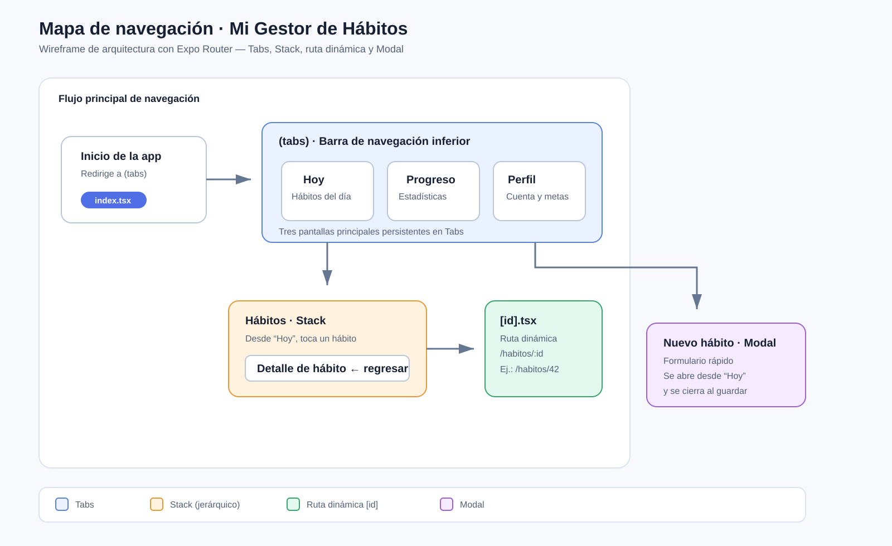

# Arquitectura de navegación

## Wireframe de navegación



El diagrama muestra las tres pantallas persistentes de la barra inferior: **Hoy**, **Progreso** y **Perfil**. El diseño corresponde al proyecto personal **Mi Gestor de Hábitos**.

## Explicación del flujo

La aplicación abre en el grupo `(tabs)`. Desde **Hoy** se puede abrir el formulario **Nuevo hábito** mediante un `Link` declarativo hacia `/modal`; el Root Stack lo presenta como modal para conservar el contexto de la pestaña. El botón “Ver detalle” usa `useRouter()` y `router.push()` para navegar a `/habitos/[id]`.

La ruta `app/habitos/[id].tsx` lee el identificador con `useLocalSearchParams()`, busca el hábito en el estado compartido y muestra visualmente su nombre, meta e id. Como pertenece al Stack raíz, tiene botón de regreso automático. Las rutas no existentes se resuelven en `app/+not-found.tsx`.

## Estructura implementada

```text
app/
├── (tabs)/
│   ├── _layout.tsx
│   ├── index.tsx
│   ├── perfil.tsx
│   └── progreso.tsx
├── habitos/
│   └── [id].tsx
├── +not-found.tsx
├── _layout.tsx
└── modal.tsx
docs/
├── README.md
└── wireframe-navegacion.svg
src/
└── context/
    └── HabitsContext.tsx
```

## Prompt de Arquitectura utilizado

> Actúa como un Arquitecto Senior de Software en React Native. Analiza la estructura de archivos que utilicé para mi aplicación en Expo Router:
>
> [PEGA AQUÍ TU ESTRUCTURA DE CARPETAS]
>
> Por favor:
>
> 1. Evalúa si mi separación de conceptos entre rutas y lógica de negocio es adecuada.
> 2. Propón una arquitectura alternativa profesional basada en el patrón **Feature-First** (creando una carpeta `/src` fuera de `/app`).
> 3. Explica 2 ventajas y 2 desventajas de migrar mi proyecto a esa arquitectura sugerida.

## Comparativa técnica (IA)

### Evaluación de la separación actual

La separación es adecuada para una aplicación pequeña o académica. `app/` define las rutas de Expo Router, los layouts y las pantallas; `src/context/HabitsContext.tsx` concentra el estado compartido y las operaciones para consultar o crear hábitos. Esta decisión evita que el modal y las pantallas de tabs dupliquen la lista de hábitos.

La limitación es que las pantallas de `app/` todavía contienen componentes de presentación y parte del comportamiento de cada caso de uso. Si la aplicación creciera con persistencia, API, validaciones y más entidades, esas rutas podrían quedar demasiado extensas y mezclar navegación con lógica de producto.

### Alternativa profesional: Feature-First

Se recomienda conservar `app/` como una capa fina de routing y agrupar cada funcionalidad en `src/features`:

```text
app/
├── (tabs)/
│   ├── _layout.tsx
│   ├── index.tsx
│   ├── perfil.tsx
│   └── progreso.tsx
├── habitos/[id].tsx
├── modal.tsx
└── _layout.tsx
src/
├── features/
│   └── habits/
│       ├── components/
│       │   ├── HabitCard.tsx
│       │   └── HabitForm.tsx
│       ├── context/
│       │   └── HabitsContext.tsx
│       ├── hooks/
│       │   └── useHabit.ts
│       ├── services/
│       │   └── habits.service.ts
│       ├── types.ts
│       └── screens/
│           ├── HabitDetailScreen.tsx
│           └── TodayScreen.tsx
├── components/
├── lib/
└── theme/
```

Cada archivo de `app/` importaría una pantalla desde `src/features/habits/screens`. Los componentes, tipos, estado y servicios de hábitos permanecerían juntos; `src/components` se reservaría para elementos reutilizables por varias funcionalidades.

### Ventajas

1. **Escalabilidad y cohesión:** todo lo relacionado con hábitos vive en un mismo módulo. Es más fácil encontrar, probar y modificar código.
2. **Rutas simples y reutilizables:** `app/` se concentra en URL, layouts y opciones de navegación; la lógica y las pantallas pueden reutilizarse y probarse de forma aislada.

### Desventajas

1. **Más estructura inicial:** para un prototipo pequeño añade carpetas y convenciones que pueden ser innecesarias.
2. **Disciplina de límites:** se debe decidir qué es compartido y qué pertenece a cada feature; sin criterios consistentes pueden aparecer dependencias cruzadas.

### Conclusión personal

Aplicaría Feature-First en proyectos de gran escala porque mantiene juntas las piezas que evolucionan por una misma necesidad de negocio y evita que las rutas se conviertan en archivos demasiado grandes. Para este ejercicio conservaría una solución simple con `app/` y un contexto en `src/`, porque es clara y suficiente. Migraría a `src/features` cuando haya varias entidades, acceso a API, estado compartido más complejo o más de una persona trabajando en la aplicación.
